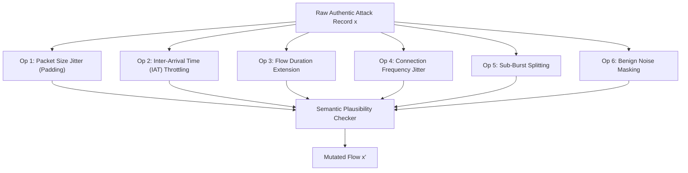

# Research Frontier D: Adversarial Detection Mutation Threat Model

> **Architecture Design Document & Threat Model**  
> **Status**: Approved Specification (Safe Offline Evaluation Only)  
> **Implementation Target**: `adversarial/mutation_lab.py`, `evaluation/run_adversarial_mutation.py`

---

## 1. Executive Summary & Safety Principles

Machine learning intrusion detection models and statistical anomaly detectors frequently exhibit high test accuracy on static benchmarks while suffering severe degradation when exposed to subtle, semantics-preserving modifications.

The **AHRAS Adversarial Detection Mutation Lab** provides a rigorous, controlled offline evaluation harness to measure:
1. **Decision Boundary Fragility**: How much does detector confidence drop when flow timing or size is minimally perturbed?
2. **Feature Perturbability**: Which telemetry dimensions provide the highest leverage for evasion?
3. **Explanation Invariance**: Does the causal or SHAP explanation flip when an irrelevant feature is manipulated?

### Mandatory Safety Guardrails
* **Offline Dataset-Level Evaluation Only**: The Mutation Lab operates strictly on offline feature representations and historical datasets (`DatasetRecord`, OCSF JSON).
* **No Live Weaponization**: The lab does NOT generate functional shellcode, malicious binaries, or executable network exploits.
* **Semantic Invariance Invariant**: All mutations must preserve the underlying network transport and application semantics (e.g. packet counts cannot be negative; durations cannot be zero; protocol checksums and flag combinations must remain RFC-valid).

---

## 2. Threat Model Definition

### 2.1 Attacker Objective
Let $f: \mathcal{X} \to [0, 1]$ be the detector's confidence score and $R: \mathcal{X} \to [0, 1]$ be the final composite risk score. The attacker seeks to generate an evasive perturbed vector $x' = x + \delta$ such that:

$$R(x') < \tau^* \quad \text{subject to} \quad \|\delta\|_p \le \epsilon \quad \text{and} \quad \text{Semantics}(x') = \text{Semantics}(x)$$

Where $\tau^*$ is the locked operational decision threshold.

### 2.2 Attacker Knowledge Levels
1. **Black-Box (BB)**: Attacker has no access to model weights, training datasets, or internal architecture. Attacker observes only binary alert verdicts or rate-limiting feedback. Evasion relies on randomized timing jitter, byte padding, and flow splitting.
2. **Gray-Box (GB)**: Attacker knows the feature schema (e.g. OCSF 18 network features) and high-level detector types (Isolation Forest + Autoencoder + Suricata rules), but does not possess exact trained weight matrices or conformal thresholds.
3. **White-Box (WB)**: Attacker possesses full model architecture, parameters $W$, and calibration intercepts. Optimization uses projected gradient descent (PGD) over differentiable surrogate losses.

### 2.3 Perturbation Budget ($\epsilon$)
Perturbations are strictly constrained within a maximum budget:
$$\|\delta\|_{\infty} \le \epsilon_{\text{max}} = 0.20 \quad \text{and} \quad \|\delta\|_1 \le B_1$$

Where features that cannot be modified without breaking the attack (e.g. `dst_port = 80` for an HTTP attack) are strictly masked:
$$\delta_j = 0 \quad \forall j \in \mathcal{F}_{\text{immutable}}$$

---

## 3. Semantics-Preserving Mutation Operators

The Mutation Lab implements six safe, domain-valid operators:

1. **Packet Size Jitter ($\pm \Delta s$)**: Appends null padding bytes to payload or headers without altering content semantics ($54 \le \text{size} \le 1500$ MTU).
2. **Inter-Arrival Timing Jitter ($\pm \Delta t$)**: Delays transmission intervals by introducing Poisson or Gaussian jitter, disrupting regular beaconing autocorrelation ($\rho \to 0$).
3. **Flow Duration Extension**: Stretches session duration by maintaining idle TCP keep-alive gaps, dropping packets-per-second (PPS) below volumetric flood thresholds.
4. **Connection Throttling**: Reduces flow initiation rate, avoiding temporal density trigger floors.
5. **Sub-Burst Splitting**: Fragments large transactions into multiple small sub-bursts.
6. **Feature Masking**: Simulates sensor truncation or missing logging fields.

---

## 4. Quantitative Metrics: Perturbability & Robustness Envelope

### 4.1 Feature Perturbability Score ($PS_j$)
Quantifies the sensitivity of the detector to variations in feature $j$:

$$PS_j = \frac{\mathbb{E}_{x \in \mathcal{D}_{\text{attack}}} [R(x) - R(x + \epsilon \cdot e_j)]}{\epsilon \cdot \sigma_j}$$

Where:
* $e_j$ is the unit vector for feature $j$.
* $\sigma_j$ is the standard deviation of feature $j$ across benign baseline traffic.
* High $PS_j$ indicates that feature $j$ is a single point of failure (brittle feature).

### 4.2 Robustness Envelope Curve
Instead of reporting a single aggregate robustness metric, the evaluation generates a continuous **Robustness Envelope** across perturbation levels $\epsilon \in [0.00, 0.02, 0.05, 0.10, 0.15, 0.20]$:

$$\text{Curve}(\epsilon) \mapsto \big(\text{Recall}(\epsilon), \text{F1}(\epsilon), \text{FPR}(\epsilon), \Delta_{\text{Risk}}(\epsilon), \text{AbstentionRate}(\epsilon)\big)$$

A robust defense architecture preserves $\text{Recall}(\epsilon) \ge 0.85$ up to $\epsilon = 0.10$, and smoothly transitions to **Conformal Abstention** ($U(x') > \tau_{\text{conf}}$) rather than issuing false benign verdicts.
