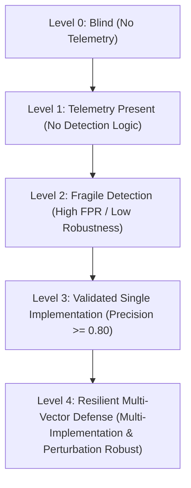

# Research Frontier A: Threat-Informed Detection Coverage Engine

> **Architecture Design Document**  
> **Status**: Approved Design Specification  
> **Implementation Target**: `coverage/` module, `evaluation/run_detection_coverage.py`

---

## 1. Executive Summary & Research Motivation

Contemporary cybersecurity evaluation frequently falls into the "Heatmap Fallacy": assuming that because a SIEM rule or IDS classifier is tagged with MITRE ATT&CK technique `T1053.005` (Scheduled Task/Job), the technique is "covered." In real-world adversarial engagements, a single ATT&CK technique manifests across dozens of behaviorally distinct implementation vectors:

* `T1053.005` via `schtasks.exe /create` (CLI invocation)
* `T1053.005` via PowerShell `New-ScheduledTaskAction` (WMI/CIM API)
* `T1053.005` via Direct Registry Modification (`HKLM\SOFTWARE\Microsoft\Windows NT\CurrentVersion\Schedule\TaskCache\Tree`)
* `T1053.005` via Direct XML Task Dropper into `C:\Windows\System32\Tasks\`
* `T1053.005` via COM Interface `ITaskService` in memory without spawning child processes.

An alert rule monitoring only `schtasks.exe` process execution covers exactly **1 out of 5** implementations, yielding an actual **Implementation Coverage (IC) of 20%**, despite displaying a green square on an ATT&CK heatmap.

AHRAS introduces a **Threat-Informed Detection Coverage Engine** that shifts the research paradigm from superficial technique tagging to concrete, behaviorally distinct implementation profiling, telemetry adequacy mapping, and quantified detection depth.

---

## 2. Mathematical Formalization

### 2.1 Implementation Coverage ($IC$)
Let $\mathcal{T}$ be the set of evaluated MITRE ATT&CK techniques. For each technique $t \in \mathcal{T}$, let $\mathcal{I}(t) = \{i_1, i_2, \dots, i_{M_t}\}$ represent the set of known, behaviorally distinct implementation vectors.

The **Implementation Coverage** $IC(t)$ for technique $t$ is:
$$IC(t) = \frac{|\{i \in \mathcal{I}(t) \mid \text{Detected}(i) = \text{True}\}|}{|\mathcal{I}(t)|} = \frac{M_{\text{detected}}(t)}{M_{\text{total}}(t)}$$

The macro-averaged system implementation coverage across all target techniques is:
$$IC_{\text{macro}} = \frac{1}{|\mathcal{T}|} \sum_{t \in \mathcal{T}} IC(t)$$

### 2.2 Telemetry Coverage ($TC$)
Even if a detection rule is not yet written, the host/network sensor fleet may or may not capture the telemetry required to observe the attack vector.

Let $\mathcal{R}_{\text{req}}(i)$ be the set of mandatory telemetry fields required to observe implementation $i$, and $\mathcal{R}_{\text{avail}}$ be the active telemetry fields emitted by the sensor pipeline.

The telemetry observability indicator for implementation $i$ is:
$$\mathcal{O}(i) = \mathbf{1}\left(\mathcal{R}_{\text{req}}(i) \subseteq \mathcal{R}_{\text{avail}}\right)$$

The **Telemetry Coverage** $TC(t)$ is:
$$TC(t) = \frac{\sum_{i \in \mathcal{I}(t)} \mathcal{O}(i)}{|\mathcal{I}(t)|}$$

By construction, $IC(t) \le TC(t) \le 1.0$. If telemetry coverage is zero, detection coverage is strictly impossible regardless of model complexity.

---

## 3. Five-Tier Coverage Depth Hierarchy

Rather than a binary "detected / not detected" flag, AHRAS classifies every technique implementation into one of five rigorous, verifiable coverage depth levels:



1. **Level 0 (Blind)**: Missing mandatory telemetry. The sensors produce no events capable of reflecting this execution path.
2. **Level 1 (Telemetry Observable)**: Required OCSF telemetry fields exist in the data stream, but no signature, anomaly, or statistical detector evaluates them.
3. **Level 2 (Fragile Detection)**: A detection rule or model fires, but empirical validation demonstrates low precision ($P < 0.60$) or extreme fragility to simple evasion/mutation.
4. **Level 3 (Validated Implementation)**: Verified detection with high precision ($P \ge 0.80$, $\text{FPR} \le 5\%$) against a specific implementation vector, backed by reproducible unit/integration tests.
5. **Level 4 (Resilient Multi-Vector Coverage)**: Multiple independent implementations of the technique are detected across distinct sensor modalities (e.g. host process + network flow + graph traversal), maintaining stability under adversarial traffic perturbation.

---

## 4. Module Architecture & Component Breakdown

The engine is isolated in [`coverage/`](coverage):

```
coverage/
├── __init__.py
├── implementation_catalog.py   # Catalog of ATT&CK techniques and concrete execution vectors
├── technique_mapper.py         # Maps AHRAS detection engines to techniques & implementations
├── telemetry_mapper.py         # Validates OCSF schema fields required vs available per vector
├── detection_analyzer.py       # Empirical precision, recall, and robustness per implementation
├── coverage_calculator.py      # Computes IC, TC, and 5-tier depth distributions
└── coverage_report.py          # Generates structured JSON gaps & LaTeX summaries
```

### 4.1 Data Contracts

```python
@dataclass
class TechniqueImplementation:
    technique_id: str             # e.g., "T1053.005"
    technique_name: str           # e.g., "Scheduled Task/Job"
    implementation_id: str        # e.g., "T1053.005-IMPL-01"
    vector_name: str              # e.g., "schtasks_cli_creation"
    execution_modality: str       # "host_cli", "host_api", "registry", "network"
    required_telemetry_fields: List[str]  # e.g., ["process.cmd", "process.parent", "user.name"]
    detecting_engines: List[str]  # ["signature:NET-001", "anomaly:process_svm"]
    coverage_level: int           # 0 to 4
    empirical_precision: float    # Measured on test partitions
    empirical_recall: float
    robustness_score: float
```

---

## 5. Detection Gap Report Schema

The output of `evaluation/run_detection_coverage.py` generates `DETECTION_COVERAGE_REPORT.json` containing actionable gap analysis:

```json
{
  "technique_id": "T1053.005",
  "implementation_coverage": 0.40,
  "telemetry_coverage": 0.80,
  "depth_level": 3,
  "covered_vectors": [
    "schtasks_cli_creation",
    "powershell_scheduled_task"
  ],
  "uncovered_vectors": [
    "direct_registry_task_cache",
    "xml_file_drop",
    "com_itaskservice_injection"
  ],
  "telemetry_gaps": [
    "registry_write_key_path",
    "file_system_write_tasks_directory"
  ],
  "actionable_recommendations": [
    "Deploy host file integrity monitoring (FIM) on %SystemRoot%\\System32\\Tasks",
    "Add registry monitoring rule for TaskCache key modifications"
  ]
}
```

---

## 6. Experimental Validation (EXP-22)

* **Experiment**: `EXP-22: Threat-Informed Detection Coverage Benchmark`
* **Test Suite**: `tests/test_detection_coverage.py`
* **Output Artifacts**:
  - `evaluation/results/DETECTION_COVERAGE_REPORT.json`
  - `publication/tables/detection_coverage.tex`
* **Invariant**: Must evaluate all active AHRAS signature rules, anomaly ensembles, statistical detectors, and graph correlation chains without external network dependencies.
