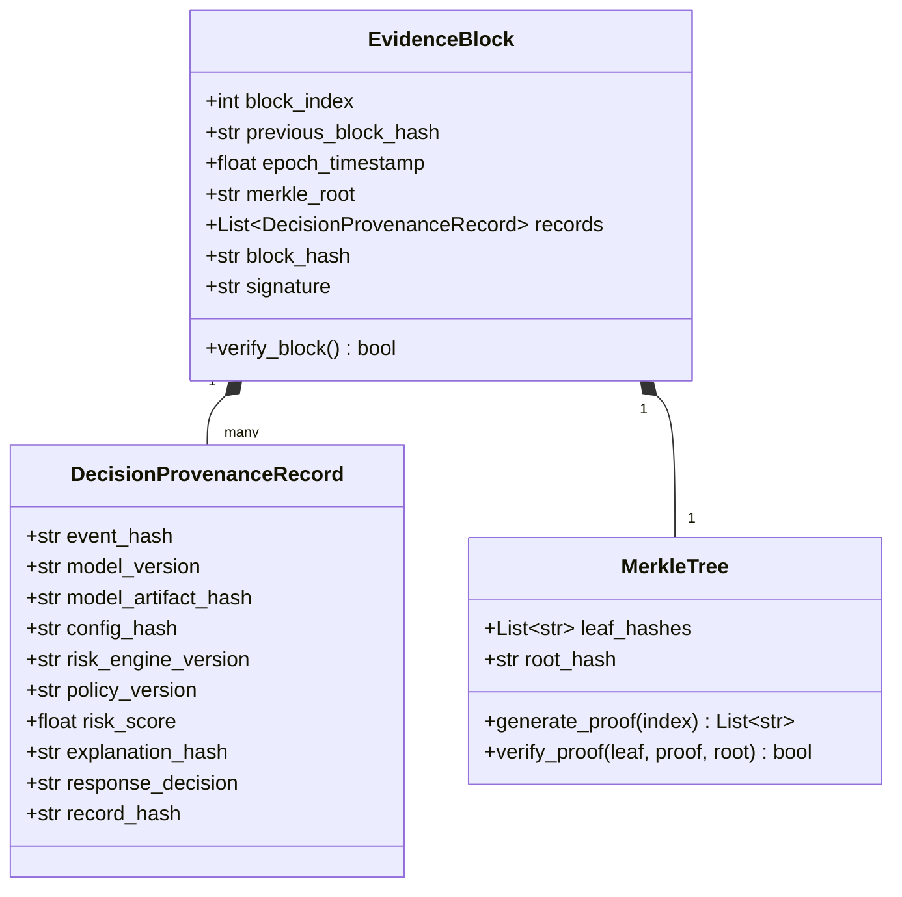

# Research Frontier H: Cryptographic Evidence & Decision Provenance

> **Architecture Design Document**  
> **Status**: Approved Design Specification  
> **Implementation Target**: `evidence/provenance_ledger.py`, `evaluation/run_evidence_provenance.py`

---

## 1. Executive Summary & Forensic Integrity Problem

In safety-critical autonomous cyber defense systems, automated response actions (e.g. host network isolation, active deception redirection, credential revocation) alter production environments. 

If an autonomous system triggers an erroneous remediation, or if an attacker attempts to tamper with forensic logs to cover their tracks, the defense platform must be able to cryptographically prove:
1. **Exactly what evidence existed at the microsecond of decision**.
2. **Which exact model artifact, weights, configuration, and thresholds produced the decision**.
3. **That no post-incident manipulation of the `DecisionTrace`, risk score, or explanation occurred**.

AHRAS hardens its existing `EvidenceLedger` by introducing an immutable, append-only **Cryptographic Evidence Blockchain & Merkle Checkpointing Architecture**.

---

## 2. Cryptographic Data Structure & Ledger Architecture

The ledger is structured into sequential cryptographic epoch blocks:



### 2.1 Block Hash Invariant
Every block $B_k$ is linked to predecessor $B_{k-1}$:

$$H(B_k) = \text{SHA256}\big( B_k.\text{index} \mathbin{\Vert} H(B_{k-1}) \mathbin{\Vert} B_k.\text{timestamp} \mathbin{\Vert} B_k.\text{MerkleRoot} \mathbin{\Vert} B_k.\text{ModelHash} \big)$$

Any retroactive alteration of an event, decision trace, model version, or explanation within block $j < k$ alters $H(B_j)$, breaking the cryptographic hash chain for all subsequent blocks $k > j$.

---

## 3. End-to-End Decision Provenance Record

For every autonomous or human-approved security decision, the system commits an immutable `DecisionProvenanceRecord`:

```python
@dataclass
class DecisionProvenanceRecord:
    record_id: str               # UUIDv4
    event_id: str
    event_hash: str              # SHA-256 of raw normalized OCSF payload
    timestamp: float
    model_version: str           # e.g. "v2.1.0-sha256:7ba2..."
    model_artifact_hash: str     # SHA-256 of active .joblib/.onnx weights
    configuration_hash: str      # SHA-256 of locked RiskConfig parameters
    risk_score: float            # Final clamped R_t in [0.0, 1.0]
    epistemic_uncertainty: float # U(x_t)
    conformal_tau: float         # Locked calibration quantile
    autonomy_status: str         # "AUTONOMOUS_PASS", "HUMAN_APPROVED", "BLOCKED"
    explanation_hash: str        # SHA-256 of causal explanation graph
    response_action: str         # "ISOLATE_HOST", "REVOKE_TOKEN", "LOG_ONLY"
    operator_id: Optional[str]   # Human user ID if manually approved
    record_hash: str             # Canonical SHA-256 of above fields
```

---

## 4. Merkle Checkpointing & Tamper Verification

### 4.1 Periodic Merkle Checkpoints
Every $N = 100$ decisions (or every 60 seconds), the engine constructs a binary Merkle tree over all leaf record hashes:
$$h_{i, 0} = H(\text{Record}_i)$$
$$h_{i, l} = H(h_{2i, l-1} \mathbin{\Vert} h_{2i+1, l-1})$$

The resulting `merkle_root` is persisted to disk (`data/ledger/checkpoints.jsonl`) and optionally signed with a local ED25519 or HMAC private key.

### 4.2 Tamper Detection API
The ledger exposes four deterministic validation primitives:
* `append(record)`: Adds record and updates active block state.
* `checkpoint()`: Seals current epoch block, computes Merkle root, writes to disk.
* `verify_chain()`: Scans the entire ledger history from genesis to present, verifying all block links and Merkle proofs. Returns `(True, None)` or `(False, TamperedBlockIndex)`.
* `tamper_detect(record_id)`: Generates cryptographic proof confirming whether a given decision has been altered.

---

## 5. Experimental Validation (EXP-29)

* **Experiment**: `EXP-29: Cryptographic Decision Provenance & Tamper Resilience Benchmark`
* **Test Suite**: `tests/test_evidence_provenance.py`
* **Tamper Scenarios Evaluated**:
  1. **Event Payload Modification**: Flipping a single byte in `raw_event`.
  2. **Model Version Substitution**: Altering model version string or weight hash.
  3. **Risk Score Manipulation**: Lowering risk score to evade autonomous response audit.
  4. **Explanation Truncation**: Deleting a causal factor from the XAI trace.
  5. **Block Deletion / Truncation**: Removing an intermediate epoch block.
* **Acceptance Invariant**: 100% of tamper attempts must be detected ($p_{\text{detect}} = 1.0$), pinpointing the exact corrupted block and field.
