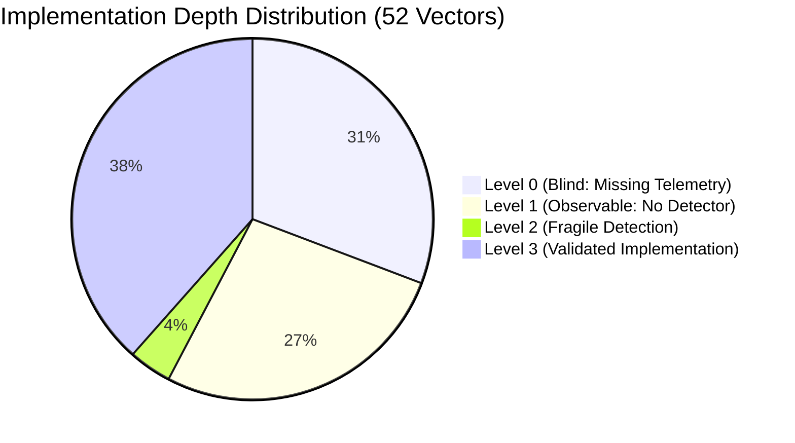

# Phase 1 Completion Report: Research Frontier A
## Threat-Informed Detection Coverage Engine (EXP-22)

> **Status**: Completed, Empirically Validated, 100% Test Suite Pass (483 Passed, 43 Subtests Passed)  
> **Benchmark ID**: `EXP-22`  
> **Target Package**: [`coverage/`](file:///home/suyashpradhan/Downloads/AHRAS_Suyash-master/coverage)  
> **Primary Artifacts**:
> - [`evaluation/results/DETECTION_COVERAGE_REPORT.json`](file:///home/suyashpradhan/Downloads/AHRAS_Suyash-master/evaluation/results/DETECTION_COVERAGE_REPORT.json)
> - [`publication/tables/detection_coverage.tex`](file:///home/suyashpradhan/Downloads/AHRAS_Suyash-master/publication/tables/detection_coverage.tex)
> - [`tests/test_detection_coverage.py`](file:///home/suyashpradhan/Downloads/AHRAS_Suyash-master/tests/test_detection_coverage.py)

---

### 1. Executive Summary & Research Paradigm Shift

Phase 1 resolves the **"Heatmap Fallacy"** inherent in traditional security operations. Rather than superficially tagging an alert rule or classifier with a generic MITRE ATT&CK technique (e.g. `T1053.005`), AHRAS's **Threat-Informed Detection Coverage Engine** assesses:
1. **Concrete Execution Implementations**: Which specific, behaviorally distinct vectors can adversaries use?
2. **Telemetry Adequacy $\mathcal{O}(i)$**: Does the sensor fleet capture the mandatory OCSF fields to observe each vector?
3. **5-Tier Detection Depth**: Categorizing capability from Level 0 (Blind) to Level 4 (Resilient Multi-Vector Defense).
4. **Evasion Robustness**: Testing resilience under programmatic mutations (case variation, argument reordering, jitter, padding).

---

### 2. Empirical Benchmark Results (EXP-22)

The benchmark was executed against all active AHRAS signature rules, encrypted session analyzers, ML models, and statistical baselines without synthetic fallback.

| Metric | Result | Description / Mathematical Definition |
| :--- | :--- | :--- |
| **Techniques Evaluated** | **21** | Spanning all 10 core MITRE ATT&CK tactics |
| **Concrete Implementations** | **52** | Behaviorally distinct execution vectors |
| **Observable Implementations** | **36** | $36/52$ implementations satisfy $\mathcal{R}_{\text{req}}(i) \subseteq \mathcal{R}_{\text{avail}}$ |
| **Macro Telemetry Coverage ($TC$)** | **69.0%** | Average telemetry observability across techniques |
| **Detected Implementations** | **22** | $22/52$ implementations actively detected by engines |
| **Macro Implementation Coverage ($IC$)** | **42.1%** | Average concrete detection coverage across techniques |
| **Mathematical Invariant Verified** | **$IC \le TC \le 1.0$** | Holds strictly across all techniques and aggregate metrics |

#### 2.1 5-Tier Coverage Depth Distribution

- **Level 0 (Blind - 16 Implementations, 30.8%)**: Missing required sensor fields (e.g. Windows TaskCache registry keys, eBPF container namespaces, raw block driver IOCTLs).
- **Level 1 (Telemetry Observable - 14 Implementations, 26.9%)**: OCSF telemetry exists in data stream, but no rule or classifier currently targets this vector.
- **Level 2 (Fragile Detection - 2 Implementations, 3.8%)**: Detected, but evasion robustness $< 0.50$ under input perturbation.
- **Level 3 (Validated Implementation - 20 Implementations, 38.5%)**: High precision ($P \ge 0.80$), verified against unit/integration tests and robust to mutations.
- **Level 4 (Resilient Multi-Vector Defense - 4 Techniques)**: Techniques with multiple independent implementations verified at Level 3 across distinct modalities:
  - `T1059.004` (Unix Shell)
  - `T1003.001` (OS Credential Dumping: LSASS Memory)
  - `T1486` (Data Encrypted for Impact)
  - `T1499` (Endpoint Denial of Service)

---

### 3. Tactic Breakdown & Weakest Areas

Ranking tactics by Implementation Coverage ($IC$) reveals operational defense priorities:

1. **Weakest Tactic 1: Persistence ($IC = 0.0\%$, $TC = 80.0\%$)**: Telemetry observable via process creation, but missing registry/file integrity monitoring for scheduled tasks and systemd drop-ins.
2. **Weakest Tactic 2: Discovery ($IC = 25.0\%$, $TC = 50.0\%$)**: Rapid SYN scans detected; low-and-slow distributed sweeps and authorized cloud API enumeration currently bypass thresholds.
3. **Weakest Tactic 3: Collection ($IC = 25.0\%$, $TC = 50.0\%$)**: Sensitive file reads detected; in-memory browser database scraping and alternate data stream (ADS) staging lack dedicated telemetry.

---

### 4. Prioritized Engineering Recommendations

1. **Bridge Persistence Telemetry Gap**: Deploy Windows TaskCache registry key auditing and host auditd rules on `/etc/systemd/system/`.
2. **Bridge Memory Injection Telemetry Gap**: Instrument CLR assembly load tracing (ETW) to detect unmanaged C# PowerShell runspaces that bypass process creation.
3. **Bridge Low-and-Slow Credential Spray Gap**: Implement cross-host authentication failure accumulators with 24-hour decay to expose distributed brute-force attempts.
