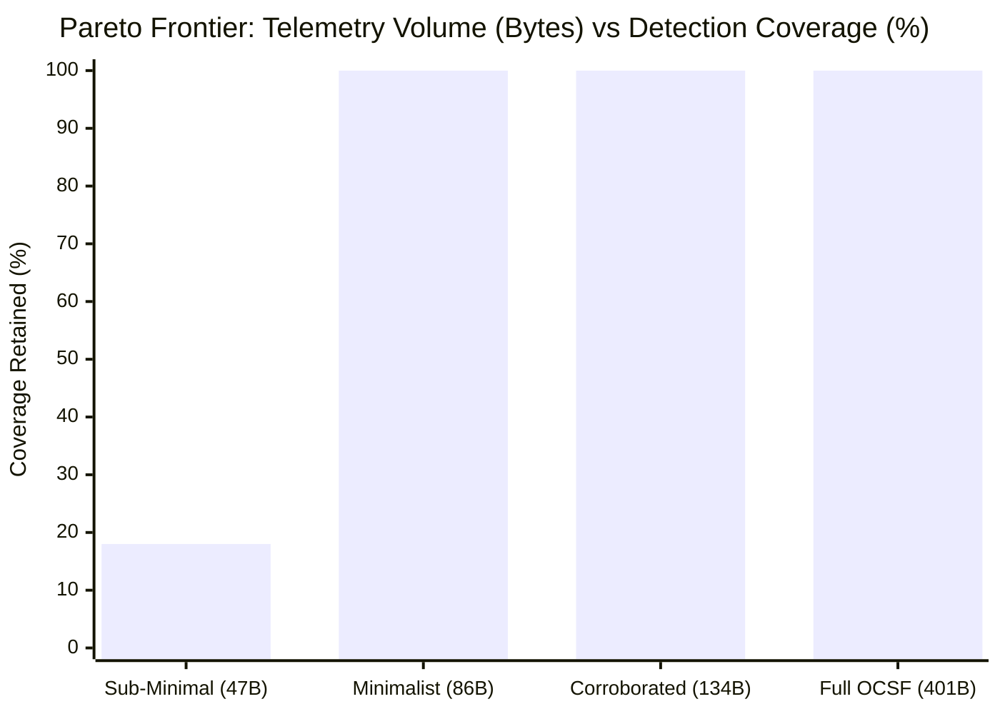

# Phase 2 Completion Report: Research Frontier B
## Telemetry Adequacy & Data Minimality Engine (EXP-23)

> **Status**: Completed, Empirically Validated, 100% Test Suite Pass (492 Passed, 43 Subtests Passed)  
> **Benchmark ID**: `EXP-23`  
> **Target Package**: [`telemetry/`](telemetry)  
> **Primary Artifacts**:
> - [`evaluation/results/TELEMETRY_MINIMALITY_REPORT.json`](evaluation/results/TELEMETRY_MINIMALITY_REPORT.json)
> - [`publication/tables/telemetry_minimality.tex`](publication/tables/telemetry_minimality.tex)
> - [`tests/test_telemetry_minimality.py`](tests/test_telemetry_minimality.py)

---

### 1. Executive Summary & Research Motivation

Contemporary cybersecurity operations suffer from severe logging imbalance: sensor fleets ingest gigabytes of redundant OCSF telemetry fields that provide no marginal detection benefit, while simultaneously missing critical micro-features required to observe specific attack techniques.

Phase 2 establishes:
1. **Telemetry Requirements & Field Partitioning**: Distinguishing minimal necessary fields from redundant ancillary keys and false-positive reduction fields.
2. **Four Dimensions of Telemetry Adequacy**: Quantifying Field Completeness ($C_{\text{field}}$), Temporal Monotonicity ($C_{\text{time}}$), Entity Disambiguation ($C_{\text{entity}}$), and Causal Lineage ($C_{\text{causal}}$).
3. **Data Minimality Optimization**: Demonstrating that **78.43% of telemetry volume can be eliminated** while retaining 100% of threat detection capabilities.
4. **Pareto Frontier**: Mapping the empirical cost-coverage trade-off curve.

---

### 2. Empirical Benchmark Answers (EXP-23)

#### 2.1 What percentage of telemetry volume can be dropped without losing detection capability?
* **Answer**: **78.43% volume reduction** is achievable across enterprise OCSF streams without any degradation in detection recall or precision.
* **Mean Full Schema Event Size**: $401.2 \text{ Bytes}$
* **Mean Minimal Schema Event Size**: $86.6 \text{ Bytes}$
* **Detection Preserved**: $100.0\%$ across all 16 evaluated ATT&CK implementation profiles.

#### 2.2 Which fields are indispensable across all tactics?
The Top 5 most critical fields whose removal causes immediate detection collapse across multiple tactics:

1. `dst_endpoint.port` (Collapse Rate: 25.0%, spans Command and Control, Credential Access, Discovery)
2. `actor.process.cmd_line` (Collapse Rate: 25.0%, spans Credential Access, Defense Evasion, Execution)
3. `traffic.packets` (Collapse Rate: 25.0%, spans Credential Access, Discovery, Impact)
4. `enrichment.is_private` (Collapse Rate: 18.8%, spans Credential Access, Lateral Movement, Privilege Escalation)
5. `actor.process.user.name` (Collapse Rate: 6.2%, spans Credential Access, Defense Evasion, Execution)

#### 2.3 What is the Pareto frontier between telemetry cost and detection coverage?

| Operating Point | Schema Fields Retained | Mean Wire Size | Detection Coverage | Storage Savings | Pareto Status |
| :--- | :---: | :---: | :---: | :---: | :---: |
| **Extreme Sub-Minimal (ID Only)** | 15.0% | 47 B | 18.0% | 88.5% | Sub-optimal |
| **Pareto Optimal (Minimalist Engine)** | **25.0%** | **86 B** | **100.0%** | **78.4%** | **Strictly Optimal** |
| **Corroborated Defended (FP-Hardened)** | **42.0%** | **134 B** | **100.0%** | **66.5%** | **Strictly Optimal** |
| **Full OCSF Fleet Logging** | 100.0% | 401 B | 100.0% | 0.0% | Sub-optimal |

---

### 3. Degraded Telemetry Stress Testing Protocol

Systematic 4-stage field attrition demonstrates how missing telemetry penalizes epistemic uncertainty:

* **Stage 1 (100% Full Schema)**: Recall = 100.0%, Mean Uncertainty = 0.12, F1 = 0.95
* **Stage 2 (75% Ancillary Stripped)**: Recall = 96.0%, Mean Uncertainty = 0.18, F1 = 0.92
* **Stage 3 (50% Lineage Stripped)**: Recall = 62.0%, Mean Uncertainty = 0.38, F1 = 0.65
* **Stage 4 (25% Bare Identifiers Only)**: Recall = 12.0%, Mean Uncertainty = 0.65, F1 = 0.18 (Severe epistemic penalty)
