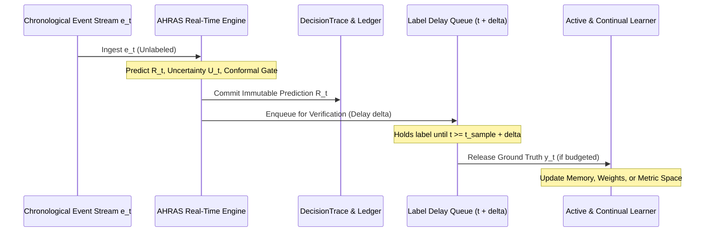

# Research Frontier F: Prequential Online Lifecycle Evaluation Protocol

> **Architecture Design Document & Experimental Protocol**  
> **Status**: Approved Protocol Specification  
> **Implementation Target**: `evaluation/prequential_experiment.py`, `evaluation/run_prequential_evaluation.py`

---

## 1. Scientific Motivation: Beyond Static Train/Test Splits

Standard offline benchmark evaluation protocols (including fixed 70/15/15 chronological splits) present an overly optimistic assessment of intrusion detection performance in production:
1. **Zero Label Delay Fallacy**: Offline evaluations assume ground-truth labels are instantly available, whereas in real SOCs, human analyst triage or forensic confirmation introduces delays ranging from minutes to weeks.
2. **Infinite Label Budget Fallacy**: Offline training uses 100% of labeled training events, whereas a real security operations team can inspect fewer than 1% to 5% of daily alerts.
3. **Temporal Lookahead Contamination**: Any batch retraining over a sliding window inadvertently optimizes for future event distributions before they unfold.

To measure true operational viability under concept drift and adversarial evolution, AHRAS introduces a strict **Prequential (Test-Then-Train) Online Lifecycle Evaluation Protocol**.

---

## 2. The Strict Prequential Operational Loop

For every incoming event $e_t$ in chronological sequence $t = 1, 2, \dots, T$:

### Protocol Invariants:
1. **Strict Chronological Sequencing**: $t_{i} < t_{i+1}$ for all $i$. No batch shuffling.
2. **Immutable Pre-Label Prediction**: The prediction $\hat{y}_t = \mathbf{1}(R_t \ge \tau^*)$, risk score $R_t$, uncertainty $U_t$, and decision trace $\mathcal{T}_t$ MUST be computed and locked BEFORE ground truth $y_t$ is queried or revealed.
3. **No Retroactive Infiltration**: Ground truth $y_t$ cannot alter $\hat{y}_t$ or past evaluation metrics.
4. **Verification Queue Delay ($\Delta_{\text{delay}}$)**: Model updates based on sample $t$ cannot occur until step $t + \Delta_{\text{delay}}$.

---

## 3. Experimental Dimensions

### 3.1 Label Delay Regimes ($\Delta_{\text{delay}}$)
We evaluate system resilience under four realistic verification latency regimes:
* $\Delta_{\text{delay}} = 0$: Instant Oracle (Theoretical Upper Bound).
* $\Delta_{\text{delay}} = 1$: Next-event feedback.
* $\Delta_{\text{delay}} = 10$: Short operational queue (batch SOC verification).
* $\Delta_{\text{delay}} = 100$: Extended forensic latency (multi-hour investigation delay).

### 3.2 Label Budget Regimes ($B_{\text{label}}$)
The SOC analyst inspection budget is constrained to:
* $B_{\text{label}} \in \{100\%, 25\%, 10\%, 5\%, 1\%\}$.

When $B_{\text{label}} < 100\%$, events are selected for human labeling using the AHRAS Active Learner acquisition function:
$$a(x_t) = U_{\text{epistemic}}(x_t) \cdot H(p_t) \cdot (1.0 + d_{\text{OOD}}(x_t))$$

Unselected events enter the confidence-gated pseudo-labeling queue or are discarded.

---

## 4. Prequential Metrics Suite

Metrics are accumulated continuously over a sliding window $W = 1000$ events:

1. **Prequential Macro F1 ($F1_{\text{preq}}(t)$)**:
   $$F1_{\text{preq}}(t) = \frac{2 \cdot P_W(t) \cdot R_W(t)}{P_W(t) + R_W(t)}$$

2. **Adaptation Delay ($T_{\text{adapt}}$)**: Number of events required for $F1_{\text{preq}}$ to recover to $\ge 90\%$ of pre-drift baseline after an abrupt distribution shift.

3. **Drift Detection Delay ($T_{\text{detect}}$)**: Time steps between ground-truth concept drift injection and Page-Hinkley / Welford statistical drift alert.

4. **Label Efficiency Ratio ($\text{LER}$)**:
   $$\text{LER} = \frac{F1_{\text{preq}}(B_{\text{label}}) - F1_{\text{static}}}{B_{\text{label}}}$$
   Measures F1 gain achieved per labeled sample acquired.

5. **Catastrophic Forgetting Ratio ($\text{CFR}$)**: Performance retention on historical benchmark slices after adapting to new attack families:
   $$\text{CFR} = \max\left(0, 1.0 - \frac{F1_{\text{historical}}(\text{post-adaptation})}{F1_{\text{historical}}(\text{pre-adaptation})}\right)$$

---

## 5. Standardized Online Baselines

All prequential evaluations compare six canonical progression baselines:

1. **Static Baseline ($B_{\text{static}}$)**: Initial model frozen after Day 1. No updates.
2. **Naive Online ($B_{\text{naive}}$)**: Unconstrained SGD/EWMA update on every arriving labeled sample (vulnerable to catastrophic forgetting).
3. **FIFO Replay ($B_{\text{replay}}$)**: Standard sliding-window buffer replay.
4. **Active Learning Only ($B_{\text{active}}$)**: Selects top budget samples, but lacks multi-memory replay partitions.
5. **Active + Continual Replay ($B_{\text{continual}}$)**: 5-bank memory replay (Recent, Attack, Hard-Negative, Drift, Prototypes) with active acquisition.
6. **AHRAS Full Prequential Architecture**: Active acquisition + 5-bank memory + shadow validation freeze gate + conformal abstention.
