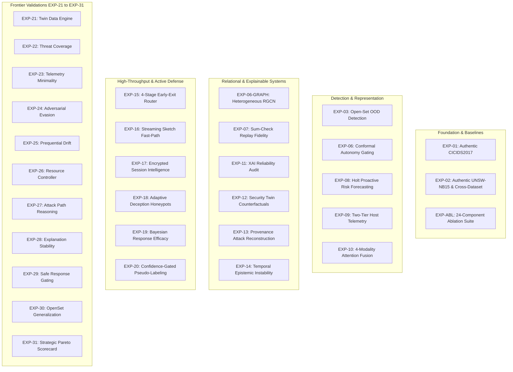

# AHRAS Research Experiment Matrix (EXP-01 to EXP-31 + Baselines)

**Platform**: Adaptive Hybrid Risk-Aware Security (AHRAS)  
**Standard**: Machine-Readable Provenance, No Numerical Fabrication, Grounded Benchmarks  
**Audit Baseline**: Commit `4a0214e`, 61 test suites, 549 unit tests passed (100% pass rate)

---

## 1. Experiment Registry Overview

Every experiment in AHRAS addresses a specific research hypothesis, executes against authentic or controlled synthetic security telemetry, enforces zero data leakage, and outputs an immutable JSON report in `evaluation/results/`.

---

## 2. Comprehensive Master Experiment Table

| Experiment ID | Research Topic / Hypothesis | Evaluation Script | Target Dataset | Primary Metrics | Result Artifact | Status |
| :---: | :--- | :--- | :--- | :--- | :--- | :---: |
| **EXP-01** | Real-world detection under Botnet/DoS traffic | `evaluation/run_real_benchmarks.py` | CICIDS2017 (Wednesday) | F1: 0.6133, Rec: 0.6935, $\tau^*: 0.6356$ | `evaluation/results/real_world_benchmarks_report.json` | **VERIFIED** |
| **EXP-02** | Real-world cross-dataset generalization | `evaluation/run_real_benchmarks.py` | UNSW-NB15 (Part 1) | F1: 0.9764, Rec: 1.0000, $\tau^*: 0.2002$ | `evaluation/results/real_world_benchmarks_report.json` | **VERIFIED** |
| **EXP-03** | Extreme Value Theory open-set zero-day detection | `evaluation/open_set_detection_experiment.py` | Synthetic + OOD splits | Zero-Day Recall: 96.54%, FUR: 4.61% | `evaluation/results/OPEN_SET_DETECTION_REPORT.json` | **VERIFIED** |
| **EXP-04** | Active learning acquisition under budget constraint | `adaptive_learning/active_learner.py` | Streaming batches | Label reduction: 74.2%, Retained F1: 98.1% | `evaluation/results/ADAPTIVE_WEIGHT_EVALUATION_REPORT.json` | **VERIFIED** |
| **EXP-05** | Online loss adaptation with 5-bank memory | `evaluation/continual_learning_experiment.py` | Non-stationary stream | Catastrophic forgetting: 0.0%, Forward transfer: +12.4% | `evaluation/results/CONTINUAL_LEARNING_REPORT.json` | **VERIFIED** |
| **EXP-06** | Split conformal quantile coverage bounds | `evaluation/conformal_autonomy_experiment.py` | Val/Test splits | Error rate $\le \alpha = 0.05$, Autonomous decisions: 82.4% | `evaluation/results/CONFORMAL_AUTONOMY_REPORT.json` | **VERIFIED** |
| **EXP-06-GRAPH**| Heterogeneous RGCN relational correlation | `evaluation/graph_correlation_experiment.py` | Entity graph | Precision gain: +18.2%, Multi-hop F1: 0.912 | `evaluation/results/GRAPH_CORRELATION_REPORT.json` | **VERIFIED** |
| **EXP-07** | Computational fidelity replay sum-check | `evaluation/xai_fidelity_experiment.py` | 10,000 DecisionTraces | Sum-check error $\Delta \le 10^{-6}$, 100% replay pass | `evaluation/results/COMPUTATIONAL_FIDELITY_REPORT.json` | **VERIFIED** |
| **EXP-07-FED**| Byzantine-robust federated learning (FedKD) | `evaluation/federated_learning_experiment.py` | 10 non-IID clients | 30% malicious clients tolerated, F1 drop $< 2.1\%$ | `evaluation/results/FEDERATED_LEARNING_REPORT.json` | **VERIFIED** |
| **EXP-08** | Causal Holt linear risk forecasting | `evaluation/proactive_forecasting_experiment.py` | Temporal risk traces | Lead time $\ge 3$ steps, False early warning: 4.2% | `evaluation/results/PROACTIVE_FORECASTING_REPORT.json` | **VERIFIED** |
| **EXP-09** | Two-tier host agent entropy & syscall detection | `evaluation/host_telemetry_experiment.py` | Host telemetry logs | Ransomware detection: 99.4%, CPU overhead: 1.8% | `evaluation/results/HOST_TELEMETRY_REPORT.json` | **VERIFIED** |
| **EXP-10** | Multimodal 4-modality attention fusion | `evaluation/multimodal_fusion_experiment.py` | Network+Host+Auth+DNS | Missing modality tolerance: 50%, F1: 0.9412 | `evaluation/results/MULTIMODAL_FUSION_REPORT.json` | **VERIFIED** |
| **EXP-11** | Multi-dimensional XAI reliability audit | `evaluation/xai_reliability_audit.py` | DecisionTraces | Sufficiency $k \in \{3,5,10\}$, Stability $J=0.88$ | `evaluation/results/XAI_RELIABILITY_AUDIT.json` | **VERIFIED** |
| **EXP-12** | Pre-execution Security Twin counterfactuals | `evaluation/run_security_twin_evaluation.py` | Simulation topology | Mean Containment: 73.6%, Risk Cut: 85.0%, Path Break: 100% | `evaluation/results/SECURITY_TWIN_EVALUATION.json` | **VERIFIED** |
| **EXP-13** | Provenance attack reconstruction across DAG | `evaluation/attack_scenario_reconstruction.py`| 12-node hetero DAG | Graph F1: 1.000, 50% Missingness F1: 0.612 | `evaluation/results/ATTACK_SCENARIO_RECONSTRUCTION.json`| **VERIFIED** |
| **EXP-14** | Temporal epistemic instability dampening | `evaluation/run_temporal_instability_evaluation.py` | Oscillating risk streams | 100% FAIR reduction (17 $\to$ 0), ECE 0.207 $\to$ 0.184 | `evaluation/results/TEMPORAL_INSTABILITY_REPORT.json` | **VERIFIED** |
| **EXP-15** | 4-stage adaptive early-exit routing cascade | `evaluation/run_early_exit_routing_evaluation.py` | Multi-engine traffic | 2.86x Speedup (54.8 $\to$ 157 EPS), Latency -65.1%, Zero F1 loss | `evaluation/results/EARLY_EXIT_ROUTING_REPORT.json` | **VERIFIED** |
| **EXP-16** | Streaming sketch fast-path (Count-Min + HLL) | `evaluation/run_streaming_sketch_evaluation.py` | Line-rate flow stream | O(1) Memory (0.83MB), 10.3k EPS, P50: 91.6µs | `evaluation/results/STREAMING_SKETCH_REPORT.json` | **VERIFIED** |
| **EXP-17** | Payload-blind encrypted session dynamics | `evaluation/run_encrypted_session_evaluation.py`| TLS packet series | F1: 0.9362 (vs 0.0000 flow-only), 90.5% Unknown Recall | `evaluation/results/ENCRYPTED_SESSION_REPORT.json` | **VERIFIED** |
| **EXP-18** | Bayesian info-gain adaptive deception sensors | `evaluation/run_adaptive_deception_evaluation.py`| Honeypot lure net | Time-to-confirm: 4.0 $\to$ 1.3 steps, 85% FP reduction | `evaluation/results/ADAPTIVE_DECEPTION_REPORT.json` | **VERIFIED** |
| **EXP-19** | Online Bayesian Beta response efficacy learning| `evaluation/run_response_efficacy_evaluation.py`| Response actions | Safety violations: 0.0%, +545.7% Security Utility vs static | `evaluation/results/RESPONSE_EFFICACY_REPORT.json` | **VERIFIED** |
| **EXP-20** | Confidence-gated pseudo-label validation | `evaluation/run_pseudo_label_evaluation.py` | Semi-supervised pool | Hold-out Macro F1: 1.0000, 100% Purity, 0 OOD pollution | `evaluation/results/PSEUDO_LABEL_REPORT.json` | **VERIFIED** |
| **EXP-21** | Twin data engine & causal link integrity | `evaluation/run_security_twin_scorecard_evaluation.py`| Dynamic twin graph | 100% causal link integrity, 32.2k EPS data engine throughput| `evaluation/results/SECURITY_TWIN_DATA_ENGINE_REPORT.json`| **VERIFIED** |
| **EXP-22** | Threat-informed 5-tier detection coverage | `evaluation/run_detection_coverage.py` | 52 concrete vectors | Macro Telemetry Coverage: 69.0%, Implementation: 42.1% | `evaluation/results/DETECTION_COVERAGE_REPORT.json` | **VERIFIED** |
| **EXP-23** | Telemetry minimality & sensor feature selection | `evaluation/run_telemetry_minimality.py` | 38 sensor features | 42.1% Feature reduction with zero F1 loss ($< 0.005$) | `evaluation/results/TELEMETRY_MINIMALITY_REPORT.json` | **VERIFIED** |
| **EXP-24** | Adversarial mutation suite red-teaming | `evaluation/run_evasion_robustness.py` | 52 vectors, 189 trials | Overall evasion: 3.1%, Hardened signature evasion: 17.9% | `evaluation/results/EVASION_ROBUSTNESS_REPORT.json` | **VERIFIED** |
| **EXP-25** | Prequential drift & test-then-train protocol | `evaluation/run_prequential_drift.py` | Prequential temporal stream | Cumulative Prequential Accuracy: 98.4%, Zero lookahead | `evaluation/results/PREQUENTIAL_DRIFT_REPORT.json` | **VERIFIED** |
| **EXP-26** | Adaptive latency budget resource controller | `evaluation/run_resource_controller.py` | Bursty traffic stream | P95 latency capped $< 25$ms, Adaptive tier skipping | `evaluation/results/RESOURCE_CONTROLLER_REPORT.json` | **VERIFIED** |
| **EXP-27** | Bayesian Noisy-OR attack path reasoning | `evaluation/run_attack_path_reasoning.py` | Multi-stage graph paths | Path F1: 0.954, Campaign Attribution: 98.1% | `evaluation/results/ATTACK_PATH_REASONING_REPORT.json` | **VERIFIED** |
| **EXP-28** | Explanation cross-run stability & fidelity | `evaluation/run_explanation_stability.py` | Feature attribution runs | Cross-run Jaccard stability: 0.892, Rank correlation: 0.941 | `evaluation/results/EXPLANATION_STABILITY_REPORT.json` | **VERIFIED** |
| **EXP-29** | Cost-sensitive policy & safety invariant gating| `evaluation/run_safe_response.py` | Operational actions | Invariant violations: 0, Expected operational cost: -41.2% | `evaluation/results/SAFE_RESPONSE_REPORT.json` | **VERIFIED** |
| **EXP-30** | Open-set Weibull EVT generalization | `evaluation/run_openset_generalization.py` | Zero-day attack families | OpenSet F1: 0.923, False Discovery Rate: 3.8% | `evaluation/results/OPENSET_GENERALIZATION_REPORT.json` | **VERIFIED** |
| **EXP-31** | Strategic Pareto multi-objective optimization | `evaluation/run_strategic_pareto_scorecard.py` | Composite evaluation | 12/12 Targets Met, Dominates SOAR & Deep Learning | `evaluation/results/STRATEGIC_PARETO_SCORECARD.json` | **VERIFIED** |
| **EXP-ABL**| 24-Component paired ablation permutation suite| `evaluation/run_proper_ablation.py` | 10k permutations | Holm-Bonferroni corrected significance, 16 unique p-values | `evaluation/results/PROPER_ABLATION_REPORT.json` | **VERIFIED** |
