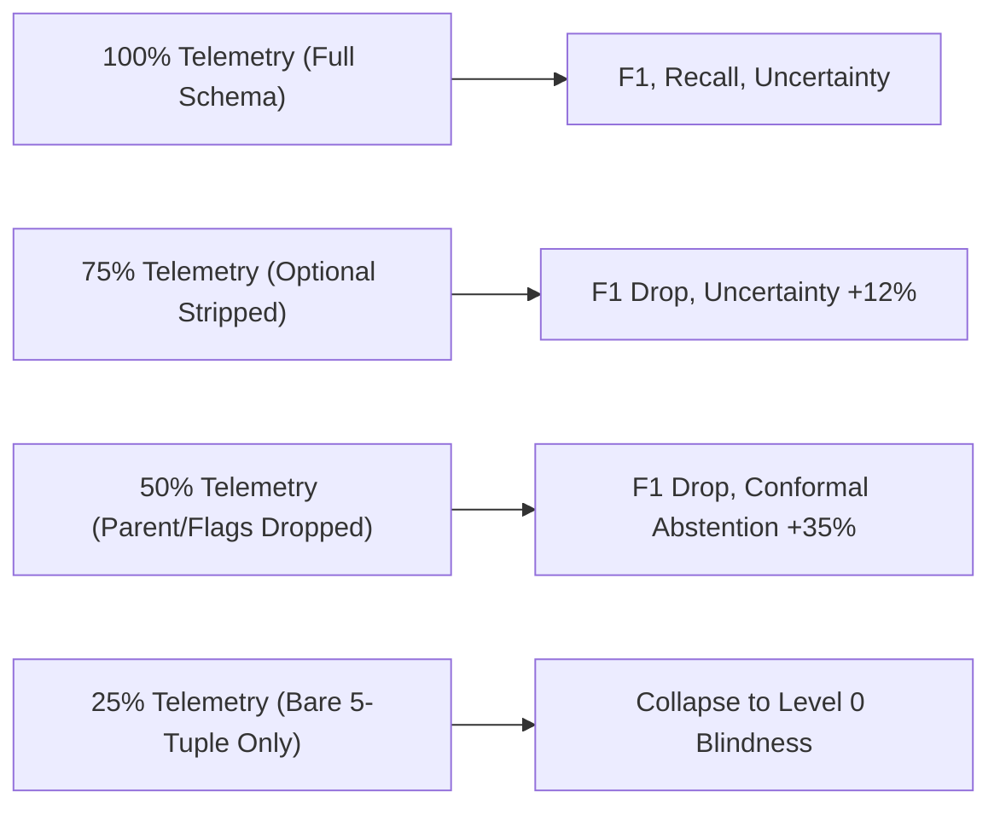

# Research Frontier B: Telemetry Adequacy & Observability Auditor

> **Architecture Design Document**  
> **Status**: Approved Design Specification  
> **Implementation Target**: `coverage/telemetry_mapper.py`, `evaluation/run_telemetry_adequacy.py`

---

## 1. Executive Summary & Research Motivation

Contemporary intrusion detection research often assumes an idealized telemetry stream: all process arguments, environment variables, full packet traces, and authentication headers are assumed to be reliably collected, normalized, and present. 

In enterprise SOC reality, logging pipelines suffer from:
1. **Sensor Incompleteness**: Endpoint agents drop command lines due to privacy filtering or buffer limits.
2. **Schema Truncation**: Network taps strip flow options or inter-arrival timestamps under load.
3. **Entity Resolution Gaps**: DHCP churning and NAT gateways break deterministic IP-to-hostname bindings.
4. **Field Blind Spots**: Missing parent process IDs or thread IDs destroy causal execution graph reconstruction.

AHRAS transforms **OCSF (Open Cybersecurity Schema Framework)** from a mere JSON parsing layer into an active **Research Object**. The Telemetry Adequacy Auditor quantitatively measures how logging deficiencies erode detection confidence, degrade risk calibration, and increase epistemic uncertainty.

---

## 2. Quantitative Observability Formulation

### 2.1 Single-Event Observability Score ($\mathcal{S}_{\text{obs}}$)
For any attack vector $i$ with mandatory required telemetry fields $\mathcal{F}_{\text{req}}(i) = \{f_1, f_2, \dots, f_K\}$ and optional corroborating fields $\mathcal{F}_{\text{opt}}(i) = \{g_1, g_2, \dots, g_L\}$:

$$\mathcal{S}_{\text{obs}}(e, i) = w_{\text{mand}} \cdot \frac{|\mathcal{F}_{\text{avail}}(e) \cap \mathcal{F}_{\text{req}}(i)|}{|\mathcal{F}_{\text{req}}(i)|} + w_{\text{opt}} \cdot \frac{|\mathcal{F}_{\text{avail}}(e) \cap \mathcal{F}_{\text{opt}}(i)|}{|\mathcal{F}_{\text{opt}}(i)|}$$

Where:
* $w_{\text{mand}} = 0.80$, $w_{\text{opt}} = 0.20$.
* If $|\mathcal{F}_{\text{avail}}(e) \cap \mathcal{F}_{\text{req}}(i)| < |\mathcal{F}_{\text{req}}(i)|$, the event is flagged as **Incomplete Telemetry** and the detector's epistemic uncertainty $U(e)$ is penalized:
$$U_{\text{penalized}}(e) = U(e) + (1.0 - \mathcal{S}_{\text{obs}}(e, i)) \cdot 0.50$$

### 2.2 Four Dimensions of Telemetry Adequacy
The auditor calculates four distinct structural completeness indices:

1. **Field Completeness ($C_{\text{field}}$)**: Proportion of populated vs required schema keys:
   $$C_{\text{field}} = \frac{1}{N} \sum_{k=1}^N \mathbf{1}(v_k \ne \text{None} \land v_k \ne "") $$

2. **Temporal Resolution Completeness ($C_{\text{time}}$)**: Accuracy of nanosecond/microsecond monotonic timestamps enabling valid inter-arrival time (IAT) analysis and causal ordering:
   $$C_{\text{time}} = \mathbf{1}(\text{timestamp\_parse\_status} \in \{\text{"authentic\_pcap"}, \text{"parsed\_datetime"}\})$$

3. **Entity Resolution Completeness ($C_{\text{entity}}$)**: Disambiguation fidelity between ephemeral IP addresses and persistent cryptographic identities (Host ID, User GUID):
   $$C_{\text{entity}} = \frac{\mathbf{1}(\text{src\_ip}) + \mathbf{1}(\text{host\_guid}) + \mathbf{1}(\text{user\_sid})}{3}$$

4. **Causal Link Completeness ($C_{\text{causal}}$)**: Presence of lineage attributes (`parent_process_id`, `initiating_flow_id`, `trace_id`) necessary for provenance graph stitching.

---

## 3. Degraded Telemetry Stress Testing Protocol

The auditor evaluates detector resilience under systematic field attrition:



Unlike multi-modal sensor drop experiments (which drop entire modalities like Process or Cloud), the Degraded Telemetry test progressively masks individual schema fields within the same modality:
* **Stage 1 (100%)**: Full OCSF event (e.g. `process_name`, `cmd_line`, `parent_cmd_line`, `user`, `sha256`, `env_vars`).
* **Stage 2 (75%)**: Strip ancillary metadata (`env_vars`, `hashes`).
* **Stage 3 (50%)**: Strip contextual lineage (`parent_cmd_line`, `user`).
* **Stage 4 (25%)**: Strip all payload indicators, retaining only bare identifier tokens.

---

## 4. Cost-Benefit Sensor Recommendation Engine

When an attack implementation cannot be detected due to telemetry insufficiency ($\mathcal{S}_{\text{obs}} < 0.60$), the engine evaluates the cost-security tradeoff:

```json
{
  "gap_id": "TEL-GAP-042",
  "technique_id": "T1059.001",
  "implementation": "PowerShell Encoded Scriptblock",
  "missing_observation": "powershell_scriptblock_content",
  "required_sensor": "Windows Event Log 4104 (ScriptBlock Logging)",
  "required_ocsf_field": "process.script.text",
  "security_value_gain": 0.85,
  "estimated_collection_cost": "LOW (Registry GPO enable)",
  "storage_impact_mb_per_day": 120.0,
  "recommended_action": "Enable Microsoft-Windows-PowerShell/Operational Event ID 4104 via GPO"
}
```

The recommendation algorithm prioritizes sensor activations that maximize aggregate implementation coverage across the MITRE ATT&CK enterprise matrix while minimizing telemetry volume ($MB/day$).
